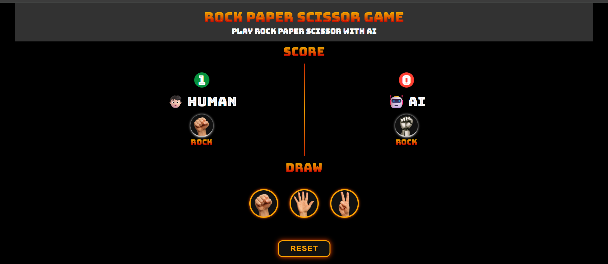

# rock_paper_scissor

A simple Rock-Paper-Scissors web game built using *HTML, CSS, and JavaScript*.  
Challenge the computer, track your score, and enjoy a responsive UI!

---

## 🧠 How to Play

- Click on ✊ Rock, ✋ Paper, or ✌ Scissors to make your move.
- The computer randomly selects its move.
- Score is updated based on who wins.
- First to reach the score limit wins the game!

---

## 🚀 Features

- 🎲 Random computer choice
- 🧮 Score tracking
- 📱 Responsive design (mobile-friendly)
- 🎨 Stylish UI with animations (if any)

---

## 🛠 Tech Stack

- HTML5
- CSS3
- JavaScript (Vanilla)

---

## 📸 Screenshot

